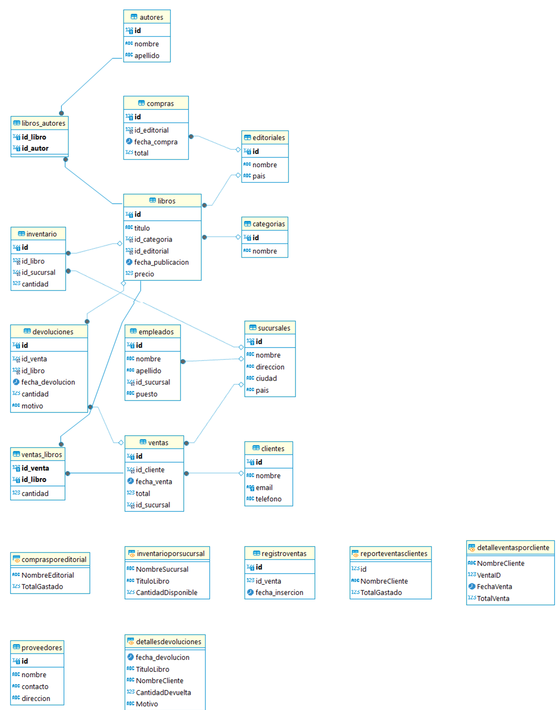

# Documentación de la Base de Datos para una Librería

## Introducción
Este documento describe el diseño y la implementación de una base de datos para una librería. La base de datos está diseñada para gestionar eficientemente información clave como libros, autores, editoriales, clientes, sucursales, empleados, inventario, ventas, compras, devoluciones, y proveedores. Con este sistema, se busca mejorar la organización y la administración de los datos relacionados con las operaciones diarias de la librería, asegurando su integridad y disponibilidad para análisis y toma de decisiones.

## Objetivo
Facilitar la gestión centralizada de las operaciones de la librería, incluyendo libros, inventario, ventas, compras y devoluciones.

## Situación Problemática
En una librería con múltiples sucursales, la gestión eficiente de la información relacionada con libros, ventas, inventario, y clientes puede volverse complicada. La falta de un sistema centralizado puede conducir a inconsistencias en los datos, problemas en la gestión de inventario, dificultades para realizar un seguimiento de las ventas y devoluciones, y una experiencia insatisfactoria para el cliente. Además, la falta de herramientas para generar informes precisos puede limitar la capacidad de tomar decisiones informadas.

## Modelo de Negocio
El modelo de negocio de la librería se basa en la venta de libros a través de múltiples sucursales, ofreciendo una amplia variedad de títulos de diferentes categorías y editoriales. La librería también se relaciona con autores y proveedores para garantizar una oferta diversa y actualizada de libros. Se gestionan los inventarios a nivel de sucursal, se realizan compras a editoriales y proveedores, y se manejan devoluciones de clientes. La base de datos soporta todas estas operaciones, desde la venta al detalle hasta la gestión de inventarios y la generación de reportes de ventas.

## Diagrama de Entidad-Relación


## Listado de Tablas con Descripción de Estructura

### Categorías
- **id:** `INT` (Primary Key, Auto Increment)
- **nombre:** `VARCHAR(255)` (No Nulo)

### Editoriales
- **id:** `INT` (Primary Key, Auto Increment)
- **nombre:** `VARCHAR(255)` (No Nulo)
- **pais:** `VARCHAR(100)`

### Autores
- **id:** `INT` (Primary Key, Auto Increment)
- **nombre:** `VARCHAR(255)` (No Nulo)
- **apellido:** `VARCHAR(255)` (No Nulo)

### Libros
- **id:** `INT` (Primary Key, Auto Increment)
- **titulo:** `VARCHAR(255)` (No Nulo)
- **id_categoria:** `INT` (Foreign Key a `Categorias`)
- **id_editorial:** `INT` (Foreign Key a `Editoriales`)
- **fecha_publicacion:** `DATE`
- **precio:** `DECIMAL(10, 2)`

### Clientes
- **id:** `INT` (Primary Key, Auto Increment)
- **nombre:** `VARCHAR(255)` (No Nulo)
- **email:** `VARCHAR(255)` (No Nulo, Único)
- **telefono:** `VARCHAR(20)`

### Sucursales
- **id:** `INT` (Primary Key, Auto Increment)
- **nombre:** `VARCHAR(255)` (No Nulo)
- **direccion:** `VARCHAR(255)` (No Nulo)
- **ciudad:** `VARCHAR(100)` (No Nulo)
- **pais:** `VARCHAR(100)` (No Nulo)

### Empleados
- **id:** `INT` (Primary Key, Auto Increment)
- **nombre:** `VARCHAR(255)` (No Nulo)
- **apellido:** `VARCHAR(255)` (No Nulo)
- **id_sucursal:** `INT` (Foreign Key a `Sucursales`)
- **puesto:** `VARCHAR(255)`

### Proveedores
- **id:** `INT` (Primary Key, Auto Increment)
- **nombre:** `VARCHAR(255)` (No Nulo)
- **contacto:** `VARCHAR(255)`
- **direccion:** `VARCHAR(255)`

### Ventas
- **id:** `INT` (Primary Key, Auto Increment)
- **id_cliente:** `INT` (Foreign Key a `Clientes`)
- **fecha_venta:** `DATE` (No Nulo)
- **total:** `DECIMAL(10, 2)`
- **id_sucursal:** `INT` (Foreign Key a `Sucursales`)

### Inventario
- **id:** `INT` (Primary Key, Auto Increment)
- **id_libro:** `INT` (Foreign Key a `Libros`)
- **id_sucursal:** `INT` (Foreign Key a `Sucursales`)
- **cantidad:** `INT` (No Nulo)

### Compras
- **id:** `INT` (Primary Key, Auto Increment)
- **id_editorial:** `INT` (Foreign Key a `Editoriales`)
- **fecha_compra:** `DATE` (No Nulo)
- **total:** `DECIMAL(10, 2)` 

### Devoluciones
- **id:** `INT` (Primary Key, Auto Increment)
- **id_venta:** `INT` (Foreign Key a `Ventas`)
- **id_libro:** `INT` (Foreign Key a `Libros`)
- **fecha_devolucion:** `DATE` (No Nulo)
- **cantidad:** `INT` (No Nulo)
- **motivo:** `VARCHAR(255)`

### Libros_Autores
- **id_libro:** `INT` (Foreign Key a `Libros`)
- **id_autor:** `INT` (Foreign Key a `Autores`)
- **PRIMARY KEY (`id_libro`, `id_autor`)**

### Ventas_Libros
- **id_venta:** `INT` (Foreign Key a `Ventas`)
- **id_libro:** `INT` (Foreign Key a `Libros`)
- **cantidad:** `INT`
- **PRIMARY KEY (`id_venta`, `id_libro`)**

### RegistroVentas
- **id:** `INT` (Primary Key, Auto Increment)
- **id_venta:** `INT` (Foreign Key a `Ventas`)
- **fecha_insercion:** `DATETIME`

## Scripts de Creación de Cada Objeto de la Base de Datos
### 1. Modificación de la Tabla `Ventas`

```sql
USE LibreriaDB;

-- Modificar la tabla Ventas para agregar la columna id_sucursal
-- Esta columna es necesaria para identificar en qué sucursal se realizó la venta
ALTER TABLE Ventas ADD id_sucursal INT;

-- Actualizar las relaciones para incluir id_sucursal
-- Esto asegura la integridad referencial entre las ventas y las sucursales
ALTER TABLE Ventas ADD FOREIGN KEY (id_sucursal) REFERENCES Sucursales(id);

-- Asignar una sucursal aleatoria a las ventas que no tienen id_sucursal asignado
UPDATE Ventas
SET id_sucursal = (
    SELECT id 
    FROM Sucursales
    ORDER BY RAND()
    LIMIT 1
)
WHERE id_sucursal IS NULL;
```
### 2. Funciones
#### 2.1. Función TotalVentasCliente
```sql
-- Elimina la función TotalVentasCliente si ya existe para evitar conflictos
DROP FUNCTION IF EXISTS TotalVentasCliente;

-- Cambiar el delimitador para poder crear las funciones correctamente
DELIMITER //

-- Función para calcular el total de ventas de un cliente
CREATE FUNCTION TotalVentasCliente(p_id_cliente INT) 
RETURNS DECIMAL(10, 2)
DETERMINISTIC
BEGIN
    DECLARE total_ventas DECIMAL(10, 2);
    
    -- Calcula el total de ventas sumando los valores en la tabla Ventas para el cliente especificado
    SELECT COALESCE(SUM(v.total), 0) INTO total_ventas 
    FROM Ventas v
    WHERE v.id_cliente = p_id_cliente;
    
    RETURN total_ventas;
END //
DELIMITER ;
```
#### 2.2. Función StockDisponible
```sql
-- Elimina la función StockDisponible si ya existe para evitar conflictos
DROP FUNCTION IF EXISTS StockDisponible;

-- Cambiar el delimitador para poder crear las funciones correctamente
DELIMITER //

-- Función para calcular el stock disponible de un libro en una sucursal específica
CREATE FUNCTION StockDisponible(id_libro INT, id_sucursal INT) 
RETURNS INT
DETERMINISTIC
BEGIN
    DECLARE stock INT;
    
    -- Consulta la cantidad disponible del libro en la sucursal específica
    SELECT cantidad INTO stock 
    FROM Inventario 
    WHERE id_libro = id_libro AND id_sucursal = id_sucursal;
    
    RETURN stock;
END //

DELIMITER ;
```
### 3. Vistas
#### 3.1. Vista InventarioPorSucursal
```sql
DROP VIEW IF EXISTS InventarioPorSucursal;

-- Vista que muestra el inventario disponible por sucursal
CREATE VIEW InventarioPorSucursal AS
SELECT s.nombre AS NombreSucursal, 
       l.titulo AS TituloLibro, 
       i.cantidad AS CantidadDisponible
FROM Inventario i
JOIN Sucursales s ON i.id_sucursal = s.id
JOIN Libros l ON i.id_libro = l.id;
```
#### 3.2. Vista DetallesDevoluciones
```sql

DROP VIEW IF EXISTS DetallesDevoluciones;

-- Vista que muestra los detalles de las devoluciones realizadas
CREATE VIEW DetallesDevoluciones AS
SELECT d.fecha_devolucion, 
       l.titulo AS TituloLibro, 
       c.nombre AS NombreCliente, 
       d.cantidad AS CantidadDevuelta, 
       d.motivo AS Motivo
FROM Devoluciones d
JOIN Libros l ON d.id_libro = l.id
JOIN Ventas v ON d.id_venta = v.id
JOIN Clientes c ON v.id_cliente = c.id;
```
#### 3.3. Vista ReporteVentasClientes
```sql
DROP VIEW IF EXISTS ReporteVentasClientes;

-- Vista que muestra el total de ventas por cliente
CREATE VIEW ReporteVentasClientes AS
SELECT c.id, c.nombre AS NombreCliente,
       TotalVentasCliente(c.id) AS TotalGastado
FROM Clientes c;
```
#### 3.4. Vista DetalleVentasPorCliente
```sql
DROP VIEW IF EXISTS DetalleVentasPorCliente;

-- Vista que muestra detalles de las ventas por cliente
CREATE VIEW DetalleVentasPorCliente AS
SELECT c.nombre AS NombreCliente, 
       v.id AS VentaID, 
       v.fecha_venta AS FechaVenta, 
       v.total AS TotalVenta
FROM Clientes c
JOIN Ventas v ON c.id = v.id_cliente;
```
#### 3.5. Vista ComprasPorEditorial
```sql
Copiar código
DROP VIEW IF EXISTS ComprasPorEditorial;

-- Vista que muestra el total gastado en compras por editorial
CREATE VIEW ComprasPorEditorial AS
SELECT e.nombre AS NombreEditorial, 
       SUM(c.total) AS TotalGastado
FROM Compras c
JOIN Editoriales e ON c.id_editorial = e.id
GROUP BY e.id;
```
### 4. Procedimientos Almacenados
#### 4.1. Procedimiento RegistrarVenta
```sql
DROP PROCEDURE IF EXISTS RegistrarVenta;

-- Cambiar el delimitador para crear los procedimientos correctamente
DELIMITER //

-- Procedimiento para registrar una nueva venta y actualizar el inventario
CREATE PROCEDURE RegistrarVenta(
    IN p_cliente_id INT,
    IN p_libro_id INT,
    IN p_cantidad INT,
    IN p_total DECIMAL(10, 2),
    IN p_sucursal_id INT
)
BEGIN
    DECLARE EXIT HANDLER FOR SQLEXCEPTION
    BEGIN
        ROLLBACK;
    END;

    START TRANSACTION;

    -- Inserta la venta en la tabla Ventas
    INSERT INTO Ventas (id_cliente, fecha_venta, total, id_sucursal)
    VALUES (p_cliente_id, CURDATE(), p_total, p_sucursal_id);
    
    SET @venta_id = LAST_INSERT_ID();

    -- Inserta los detalles de la venta en Ventas_Libros
    INSERT INTO Ventas_Libros (id_venta, id_libro, cantidad)
    VALUES (@venta_id, p_libro_id, p_cantidad);

    -- Actualiza el inventario en la sucursal correspondiente
    UPDATE Inventario 
    SET cantidad = cantidad - p_cantidad
    WHERE id_libro = p_libro_id
    AND id_sucursal = p_sucursal_id;

    COMMIT;
END //

DELIMITER ;
```
#### 4.2. Procedimiento RegistrarDevolucion
```sql
Copiar código
DROP PROCEDURE IF EXISTS RegistrarDevolucion;

-- Cambiar el delimitador para crear los procedimientos correctamente
DELIMITER //

-- Procedimiento para registrar una devolución y actualizar el inventario
CREATE PROCEDURE RegistrarDevolucion(
    IN p_venta_id INT,
    IN p_libro_id INT,
    IN p_cantidad INT,
    IN p_motivo VARCHAR(255)
)
BEGIN
    DECLARE EXIT HANDLER FOR SQLEXCEPTION
    BEGIN
        ROLLBACK;
    END;

    START TRANSACTION;

    -- Inserta la devolución en la tabla Devoluciones
    INSERT INTO Devoluciones (id_venta, id_libro, fecha_devolucion, cantidad, motivo)
    VALUES (p_venta_id, p_libro_id, CURDATE(), p_cantidad, p_motivo);

    -- Actualiza el inventario para reflejar la devolución
    UPDATE Inventario 
    SET cantidad = cantidad + p_cantidad
    WHERE id_libro = p_libro_id
    AND id_sucursal = (SELECT id_sucursal FROM Ventas WHERE id = p_venta_id);

    COMMIT;
END //

DELIMITER ;
```
### 5. Triggers
#### 5.1. Trigger ActualizarInventarioDespuesDevolucion
```sql
DROP TRIGGER IF EXISTS ActualizarInventarioDespuesDevolucion;

-- Cambiar el delimitador para crear los triggers correctamente
DELIMITER //

-- Trigger para actualizar el inventario después de una devolución
CREATE TRIGGER ActualizarInventarioDespuesDevolucion
AFTER INSERT ON Devoluciones
FOR EACH ROW
BEGIN
    UPDATE Inventario 
    SET cantidad = cantidad + NEW.cantidad
    WHERE id_libro = NEW.id_libro 
    AND id_sucursal = (SELECT id_sucursal 
                       FROM Ventas 
                       WHERE id = NEW.id_venta);
END //

DELIMITER ;
```
#### 5.2. Trigger VerificarStockAntesVenta
```sql
DROP TRIGGER IF EXISTS VerificarStockAntesVenta;

-- Cambiar el delimitador para crear los triggers correctamente
DELIMITER //

-- Trigger para verificar el stock antes de registrar una venta
CREATE TRIGGER VerificarStockAntesVenta
BEFORE INSERT ON Ventas_Libros
FOR EACH ROW
BEGIN
    DECLARE stock INT;
    SET stock = StockDisponible(NEW.id_libro, (SELECT id_sucursal FROM Ventas WHERE id = NEW.id_venta));
    
    IF stock < NEW.cantidad THEN
        SIGNAL SQLSTATE '45000' SET MESSAGE_TEXT = 'Stock insuficiente para la venta';
    END IF;
END //

DELIMITER ;
```


## Scripts de Inserción de Datos
*(Los datos se han insertado manualmente en la base de datos mediante la ejecución del script `insertarDatosLibreria.sql`. Este script contiene todas las instrucciones `INSERT INTO` necesarias para poblar las tablas de la base de datos con datos iniciales.)*

## Tabla de Hecho
- **Ventas**: Esta tabla registra cada transacción de venta realizada, incluyendo el cliente, la fecha y el total de la venta. Es una tabla de hecho porque almacena datos cuantitativos (totales de ventas) asociados a eventos de negocio (transacciones de ventas).

## Tablas Transaccionales
- **Compras**: Registra las compras realizadas a las editoriales, incluyendo la fecha de compra y el total. Es una tabla transaccional porque almacena datos de eventos de negocio específicos y detallados (transacciones de compra).
- **Devoluciones**: Registra las devoluciones de productos por parte de los clientes, incluyendo la fecha, la cantidad y el motivo de la devolución. Es una tabla transaccional porque almacena datos de eventos de negocio específicos y detallados (transacciones de devolución).
- **Inventario**: Mantiene el registro del stock disponible en cada sucursal, incluyendo las entradas y salidas de productos. Es una tabla transaccional porque almacena datos que reflejan cambios en el inventario en tiempo real.
- **Ventas_Libros**: Registra los detalles de los libros vendidos en cada transacción, incluyendo la cantidad y el libro específico asociado a una venta. Es una tabla transaccional porque almacena datos específicos de eventos de venta.
- **RegistroVentas**: Esta tabla registra el momento exacto en que se inserta una venta en la base de datos. Aunque no es una tabla transaccional típica en el sentido tradicional, se usa para auditar el momento de cada inserción de ventas, lo cual es un tipo de evento específico.

## Informes Generados en Base a la Información de la Base
- **Inventario por Sucursal:** Proporciona la cantidad disponible de cada libro en cada sucursal.
- **Detalles de Devoluciones:** Muestra la fecha de devolución, el título del libro, el nombre del cliente, la cantidad devuelta y el motivo de la devolución.
- **Total de Ventas por Cliente:** Calcula el total gastado por cada cliente.
- **Detalles de Ventas por Cliente:** Muestra detalles de las ventas, incluyendo la fecha y el total de cada venta realizada por cada cliente.
- **Total Gastado en Compras por Editorial:** Suma el total de compras realizadas a cada editorial.

## Herramientas y Tecnologías Usadas
- **Base de Datos:** MySQL
- **Lenguaje SQL:** Utilizado para la creación de tablas, vistas, funciones y procedimientos almacenados.
- **Modelado ER:** Herramientas como MySQL Workbench y DBeaver.

## Futuras Líneas
- **Mejorar el manejo de inventario:** Implementación de un sistema más avanzado de gestión de inventarios.
- **Automatización de informes:** Crear procedimientos almacenados adicionales para generar informes automáticos en intervalos regulares.
- **Seguridad:** Implementación de roles y permisos más granulares para asegurar que solo usuarios autorizados puedan acceder y modificar la base de datos.
## Backup de la base de datos

**Descripción:** Se realiza un backup de la base de datos a través de DBeaver. Se adjunta en el repositorio dentro de la carpeta `backup`

## Cómo correr el backup

```bash
make backup
```
